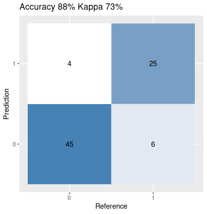
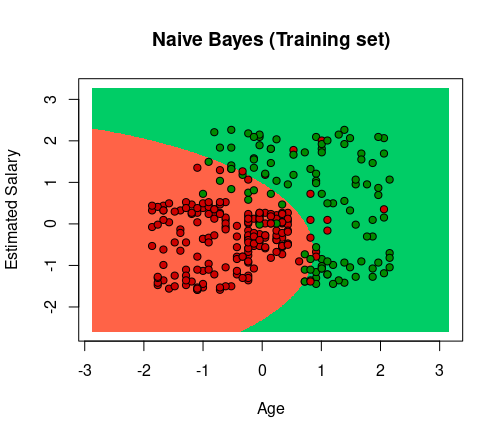

## Evaluation unit 3 - Naive Bayes

Load required libraries
```R
library(caTools)
library(e1071)
library(caret)
library(ggplot2)
library(scales)
library(caTools)
```

Importing the dataset
```R
dataset = read.csv(file = file.choose())
dataset = dataset[3:5]
dataset$Purchased = factor(dataset$Purchased, levels = c(0, 1))
```

Split into training and testing
```R
set.seed(123)
split = sample.split(dataset$Purchased, SplitRatio = 0.75)
training_set = subset(dataset, split == TRUE)
test_set = subset(dataset, split == FALSE)
```

Scaling numeric features
```R
training_set[-3] = scale(training_set[-3])
test_set[-3] = scale(test_set[-3])
```

Create the classifier
```R
classifier = naiveBayes(formula = Purchased ~ .,
                        data = training_set,
                        type = 'C-classification',
                        kernel = 'linear')
```

Predictions
```R
y_pred=predict(classifier, newdata = test_set[-3])

y_pred
```

Confusion matrix
```R
cm <- confusionMatrix(as.factor(test_set$Purchased), y_pred)

ggplotConfusionMatrix <- function(m){
  mytitle <- paste("Accuracy", percent_format()(m$overall[1]),
                   "Kappa", percent_format()(m$overall[2]))
  p <-
    ggplot(data = as.data.frame(m$table) ,
           aes(x = Reference, y = Prediction)) +
    geom_tile(aes(fill = log(Freq)), colour = "white") +
    scale_fill_gradient(low = "white", high = "steelblue") +
    geom_text(aes(x = Reference, y = Prediction, label = Freq)) +
    theme(legend.position = "none") +
    ggtitle(mytitle)
  return(p)
}

ggplotConfusionMatrix(cm)
```



Train and test
```R
set = training_set
X1 = seq(min(set[, 1]) - 1, max(set[, 1]) + 1, by = 0.01)
X2 = seq(min(set[, 2]) - 1, max(set[, 2]) + 1, by = 0.01)
grid_set = expand.grid(X1, X2)
colnames(grid_set) = c('Age', 'EstimatedSalary')
y_grid = predict(model, newdata = grid_set)
plot(set[, -3],
     main = 'Naive Bayes (Training set)',
     xlab = 'Age', ylab = 'Estimated Salary',
     xlim = range(X1), ylim = range(X2))
contour(X1, X2, matrix(as.numeric(y_grid), length(X1), length(X2)), add = TRUE)
points(grid_set, pch = '.', col = ifelse(y_grid == 1, 'springgreen3', 'tomato'))
points(set, pch = 21, bg = ifelse(set[, 3] == 1, 'green4', 'red3'))
```

```R
set = test_set
X1 = seq(min(set[, 1]) - 1, max(set[, 1]) + 1, by = 0.01)
X2 = seq(min(set[, 2]) - 1, max(set[, 2]) + 1, by = 0.01)
grid_set = expand.grid(X1, X2)
colnames(grid_set) = c('Age', 'EstimatedSalary')
y_grid = predict(classifier, newdata = grid_set)
plot(set[, -3], main = 'Naive Bayes (Test set)',
     xlab = 'Age', ylab = 'Estimated Salary',
     xlim = range(X1), ylim = range(X2))
contour(X1, X2, matrix(as.numeric(y_grid), length(X1), length(X2)), add = TRUE)
points(grid_set, pch = '.', col = ifelse(y_grid == 1, 'springgreen3', 'tomato'))
points(set, pch = 21, bg = ifelse(set[, 3] == 1, 'green4', 'red3'))
```
